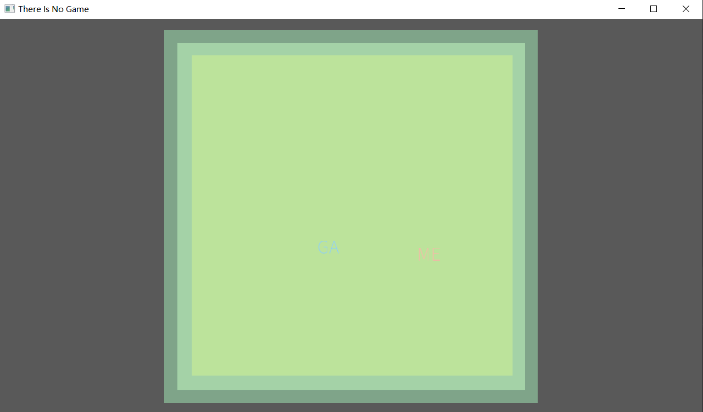

# There Is No Game

Author: Yifan Jiang (yifanj3)

## Design:
This is a 2-player game where one player plays as “GA” and the other as “ME.” The two must work together and stay connected to form “GAME.”

## Networking:

The game uses a client/server model where the server maintains the game state and sends it to clients. Clients send input messages to the server, and the server responds with state messages containing player `positions`, `velocities`, `colors`, `names`, `IDs`, and `hasWin`. It is is implemented in `Game::send_state_message` and `Game::recv_state_message` in `Game.cpp`.

Screen Shot:

## How To Play:
Use WASD to move around and form "GAME" with another player.

## Sources:

This game was built with [NEST](NEST.md).

